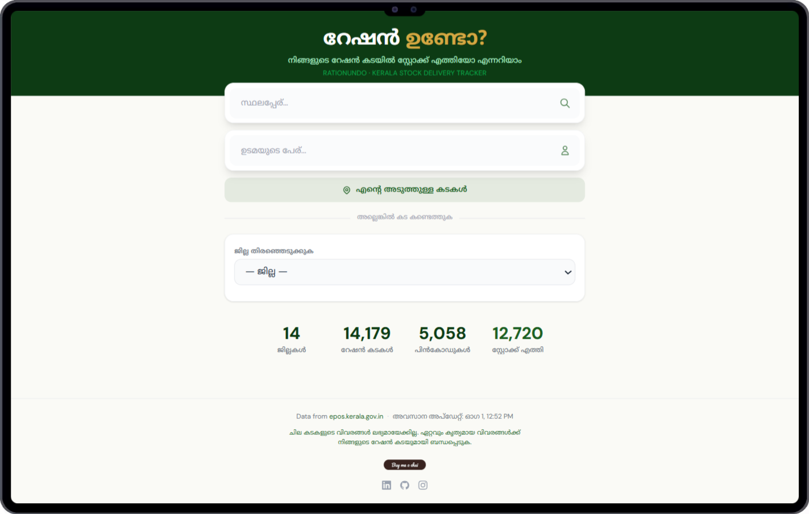
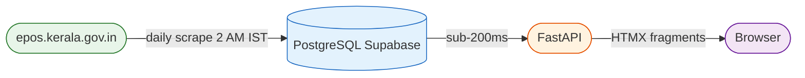
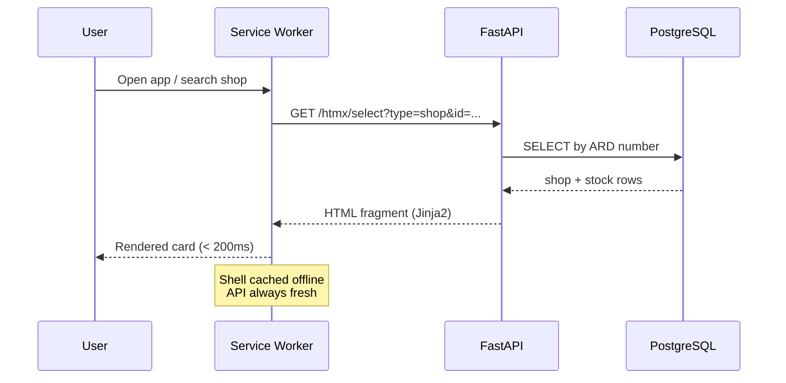

# റേഷൻ ഉണ്ടോ? · RationUndo

> Track whether your Kerala ration shop (Fair Price Shop) has received its monthly stock allocation rice, wheat, sugar, kerosene, and more.
> Search by shop number, place name, or owner. Browse by district and taluk. Use GPS to find the nearest shops.
> Data scraped daily from the official [epos.kerala.gov.in](https://epos.kerala.gov.in) portal and served fast from a local database.

---

## How it works

A **GitHub Actions cron** scrapes the official ePOS portal once a day and stores every shop's stock status in PostgreSQL. User searches are served entirely from the local DB, no external calls at request time.

---

## Data flow

---

## Features

- Search by **shop number**, **place name**, or **owner name** (fuzzy `pg_trgm`)
- **Near me** GPS search, haversine distance sort
- Browse **District > Taluk > Shop**
- **Bookmark** favourite shops (localStorage)
- Per-commodity allocated vs received quantities
- **Share** shop link via native share / WhatsApp
- **PWA** installable, offline shell via service worker
- Malayalam-first UI

Covers **14 districts · 14,000+ shops · 5,000+ pincodes** across Kerala.

---

> Data sourced from the public [epos.kerala.gov.in](https://epos.kerala.gov.in) portal.
> Not affiliated with the Government of Kerala.

 © 2026 Jithin

