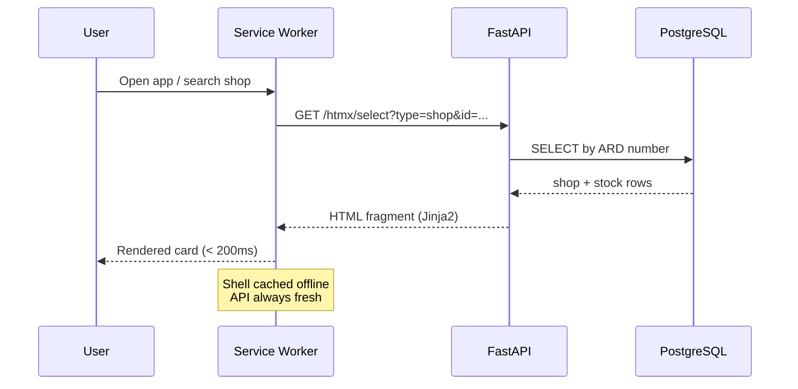

# റേഷൻ ഉണ്ടോ? · RationUndo

> Has your ration shop received stock this month?
> Kerala's Fair Price Shop stock delivery tracker, fast, offline-ready, Malayalam-first.

**[rationundo.onrender.com](https://rationundo.onrender.com)**


---


## How it works


A **GitHub Actions cron** scrapes the official ePOS portal once a day and stores every shop's stock status in PostgreSQL. User searches are served entirely from the local DB, no external calls at request time.

---

## Data flow



---

## Features

- Search by **shop number**, **place name**, or **owner name** (fuzzy `pg_trgm`)
- **Near me** GPS search, haversine distance sort
- Browse **District > Taluk > Shop**
- **Bookmark** favourite shops (localStorage)
- Per-commodity allocated vs received quantities
- **Share** shop link via native share / WhatsApp
- **PWA** installable, offline shell via service worker
- Malayalam-first UI

Covers **14 districts · 14,000+ shops · 5,000+ pincodes** across Kerala.

---

## Stack

```
Frontend    TailwindCSS (browser) · HTMX · Vanilla JS · Service Worker
Backend     FastAPI · SQLAlchemy (async) · asyncpg
Database    PostgreSQL + pg_trgm  (Supabase, free tier)
Scraper     httpx + BeautifulSoup · GitHub Actions cron (2 AM IST)
Hosting     Render (web) · Supabase (DB) · GitHub Actions (scraper)
```


> Data sourced from the public [epos.kerala.gov.in](https://epos.kerala.gov.in) portal.
> Not affiliated with the Government of Kerala.

[MIT](LICENSE) © 2026 Jithin
